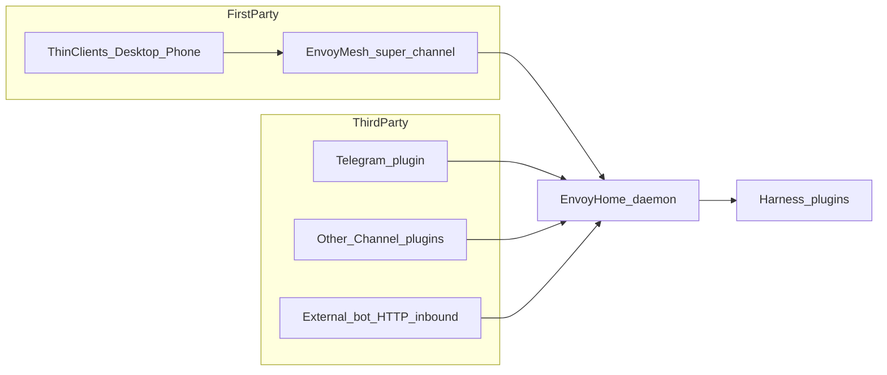

# Agreed: channels and harness

**Status:** Agreed in discussion (ahead of full EnvoyHome product define).  
**Learn, don’t copy** peer stacks wholesale.

## EnvoyMesh = first-party super channel

EnvoyMesh is **not** “just another Telegram adapter.” It is EnvoyHome’s **native reachability / companion surface**, modeled on **EnvoyDev / EnvoyCoder**:

- **Daemon** = authority (sessions, keys, pairing, agent runs)
- **Thin clients** = desktop window, phone, paired-home laptop — dial the home daemon (WS JSON-RPC + mesh dial ladder); no second brain on the client
- Family stack: `@envoymesh/*` identity, `envoy://pair`, dial ladder LAN → public → P2P → relay; daemon **hosts** embedded mesh peer (EnvoyCoder-same); phone dials hosting peer — **not** Social, **not** attach-as-phone-route
- **P2-Q4 finished:** hosting **default**; optional local attach **dual like EnvoyCoder if needed**; see Design §2.3

HomeClaw’s current `channels/envoymesh` (HTTP bridge → Core `/inbound`) is a **compat preset / debt path**, not the target product shape.

Desktop/mobile UX should feel like EnvoyCoder’s “pair once, thin client forever,” adapted for a **home assistant** (chat, memory, tools), not coding-task UI only.

## Other channels — predefined interface (third-party SDK)

EnvoyHome **must** publish a **Channel SDK** so third parties can implement any IM they want. We do **not** ship a first-party channel zoo at MVP; we ship **one demo (Telegram)** that proves the contract, plus HTTP inbound hatch. Ground truth: Design §5.

EnvoyHome supports third-party IM/chat via that **stable Channel contract**.

| Axis | OpenClaw | HomeClaw | **EnvoyHome choice** |
|------|----------|----------|----------------------|
| Process | Channels in-Gateway as `ChannelPlugin` | Separate processes / bots → Core HTTP | **Typed Channel interface owned by the daemon**; prefer **in-daemon plugins** for bundled channels; **sidecar** only when a platform needs isolation |
| Contract | Rich SDK: accounts, pairing, outbound, monitor | Dual: `POST /inbound` **or** full `BaseChannel` | **One Channel API** (normalize inbound → session/bindings → outbound). Keep **minimal HTTP inbound** escape hatch for external bots |
| Routing | Bindings account→agent | `user.yml` + friend/session | **Bindings-style** + HomeClaw-style **user allowlists** for shared-home |
| Outbound | Core `message` tool + plugin outbound | Channel delivers; Core pushes async | Daemon owns reply routing; channel implements **send/edit/react** only |
| Auth | DM pairing + allowlists | `user.yml` + channel API key | Pairing for unknown senders **and** allowlists; daemon API auth ≠ platform tokens |
| Ops | `channels add`, hot reload | `python -m channels.run <name>` | Enable/config in **one control plane**; avoid N babysat processes for day-one channels |

**Learn-from:** OpenClaw for typed plugin + bindings + lifecycle; HomeClaw for minimal inbound HTTP and out-of-process adapters when needed. EnvoyMesh stays above both as the **super channel**.

## Harness plugins

Control plane (sessions, channels, policy, memory, approvals) stays in the **EnvoyHome daemon**.

- **Built-in default:** `../envoy-harness` (`@envoymesh/envoy-harness`)
- **Also support** other harnesses as plugins (Claude Code, Codex, OpenCode, Cursor ACP, DeepSeek CLI, …) — same idea as OpenClaw harness plugins + EnvoyCoder’s multi-agent window
- Channels do **not** embed agent stacks; they call the daemon, which selects the harness

### What “harness” means

The harness is the **turn / tool-loop engine**: message + session → model ↔ tools (+ middleware) → reply. It is **not** the channel layer, memory store, or pairing control plane.

| Shape | Meaning | Examples |
|-------|---------|----------|
| **A. Pluggable runtime** | Control plane can swap which engine runs the turn | OpenClaw harness plugins; EnvoyCoder; **EnvoyHome** |
| **B. Built-in turn engine** | One shared loop all entry points call | OpenHuman `tinyagents` AgentHarness; Hermes AIAgent; HomeClaw Core loop |

**OpenHuman:** explicit harness docs — chat/channel/sub-agents share one `AgentHarness` (shape B).  
**Hermes:** AIAgent *is* the harness; no harness-plugin marketplace (shape B).  
**OpenClaw:** shape **A** — `registerAgentHarness` + built-in `openclaw` + Codex/ACP plugins.  
**EnvoyHome:** shape **A** at the product boundary; `envoy-harness` is a complete shape-**B** engine shipped as the default plugin.

Peer deep-dive (non-normative): [`../analysis/peer-harness-systems.md`](../analysis/peer-harness-systems.md).
